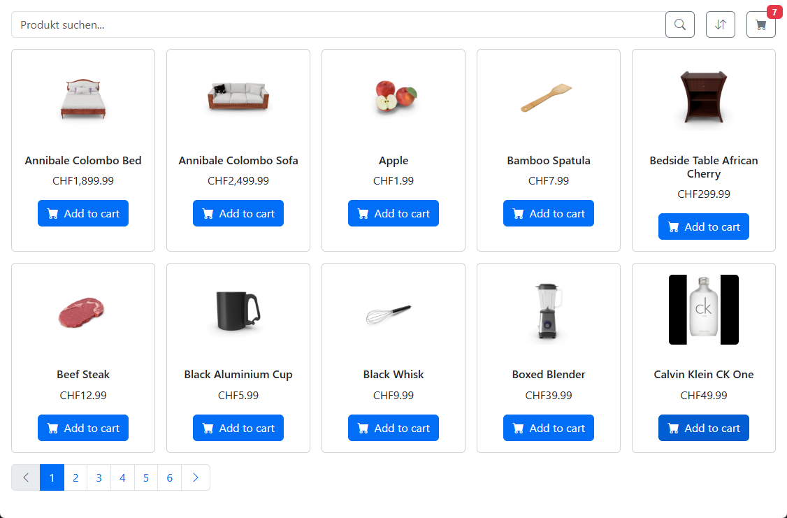
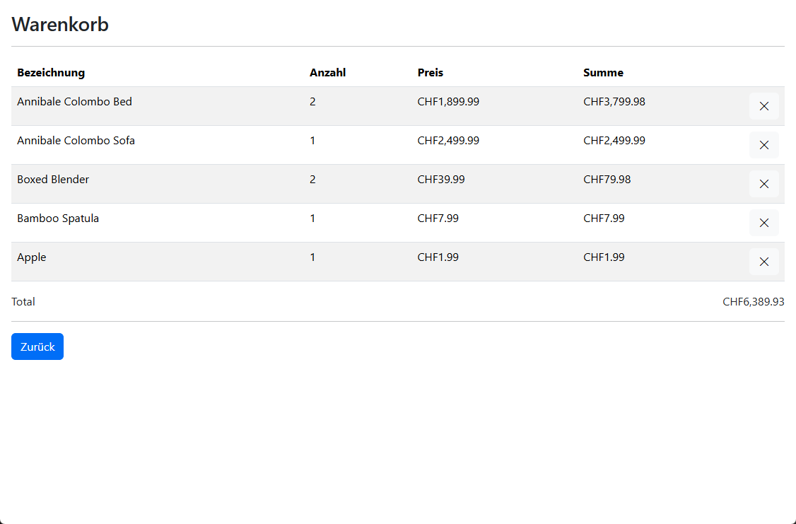

# NgRx Signal Shop Demo 🛍️

Eine kleine Demo-Anwendung mit Angular 19 zur Präsentation moderner State-Management-Konzepte mit NgRx Signal Store. 
Die App zeigt eine einfache Produktliste mit Warenkorb-Funktion.

## 🔧 Technologien

- Angular 19
- NgRx Signal Store
- Bootstrap 5
- RxJS
- TypeScript

## ✨ Features

- Produktübersicht mit Pagination, Filter- und Sortierfunktionen
- Warenkorb mit Entfernen von Produkten
- State-Management mit NgRx Signal Store
- Responsive UI mit Bootstrap 5
- Routing zwischen Produktübersicht und Warenkorb

## ▶️ Lokales Setup

```
git clone https://github.com/ronnymundt/ngrx-signal-shop-demo.git
cd ngrx-signal-shop-demo
npm install
ng serve
```

## 📸 Screenshot




